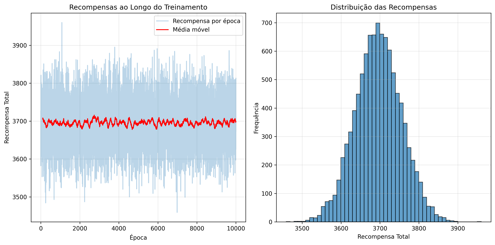

# Aprendizado por Reforço para Robô de Reciclagem

## Introdução

Este relatório descreve a implementação de um algoritmo de Aprendizado por Reforço, baseado em *Temporal Difference* (TD), para resolver o problema do Robô de Reciclagem, (Ex. 3.3 de Sutton & Barto - "Reinforcement Learning: An Introduction"). 

O agente aprende valores de estado e age com política *ε-greedy* com *one-step lookahead* usando o modelo conhecido (α, β e recompensas) para escolher ações. O objetivo é **maximizar a recompensa média** em uma tarefa contínua (desconto γ).


## Equipe

**Professor orientador:**
- Flávio Codeço Coelho

**Alunos participantes:**
- Jaime Willian Carneiro
- Luiz Eduardo Bravin
- Walleria Simões Correia

## Requisitos

Para instalar as bibliotecas necessárias, execute:
```bash
  pip install -r requirements.txt
```

## 1. Descrição do Problema (MDP)

O problema é modelado como um Processo de Decisão de Markov (MDP) finito, definido pelos seguintes componentes:

### Estados (S)

O robô pode estar em um de dois estados, baseados no seu nível de bateria:
* `high`: Nível de bateria alto.
* `low`: Nível de bateria baixo.

### Ações (A)

O conjunto de ações disponíveis depende do estado atual:
* `A(high)` = {`search`, `wait`}
* `A(low)` = {`search`, `wait`, `recharge`}

### Modelo de Transição e Recompensa

O modelo de transição e recompensa foi implementado conforme a descrição do livro-texto. As transições são probabilísticas e dependem dos seguintes parâmetros, que foram definidos para esta implementação:

* **`α`**: Probabilidade de a bateria permanecer alta após uma busca, começando com bateria alta: `high` $\rightarrow$ `search` $\rightarrow$ `high`.
* **`β`**: Probabilidade de a bateria permanecer baixa após uma busca, começando com bateria baixa: `low` $\rightarrow$ `search` $\rightarrow$ `low`.
* **`r_search`**: Recompensa esperada ao executar a ação `search`.
* **`r_wait`**: Recompensa esperada ao executar a ação `wait`.

A tabela a seguir, adaptada do livro-texto, resume a dinâmica do ambiente com os parâmetros escolhidos:

| Estado inicial | Ação | Estado final | Prob. | Recompensa  |
| :---: | :---: | :---: | :---: | :---: |
| high | search | high | α | r_search |
| high | search | low  | 1-α | r_search |
| low  | search | high | 1-β | -3 |
| low  | search | low  | β | r_search |
| high | wait   | high | 1 | r_wait |
| low  | wait   | low  | 1 | r_wait |
| low  | recharge| high| 1 | 0 |


## 2. Arquitetura do código
Modularizamos o código em três arquivos: `main.py`, `models.py` e `plot.py`

**main.py** - Arquivo principal, onde se encontram as funções `main()` responsável por inicializar o código e imprimir textos no terminal e `train()` responsável por treinar o modelo.

**models.py** - Arquivo para orientação a objetivo, onde estão modeladas as classes `Action`, `State`, `Game` e `Player`

- `Action`: identifica ação por `name`;
- `State`: identifica estado por `charge_level` e lista as `Action` permitidas por estado;
- `Player`: o robô de reciclagem. Possui os métodos `reset()` para voltar ao estado inicial, `act()` para selecionar a melhor ação a ser tomada naquele momento, `update()` para atualizar os estimadores (somente se a ação foi *greedy*) e `get_policy()` para...
- `Game`: ambiente com dinâmica (α, β, recompensas). Possui os métodos `transition()` que calcula a recompensa da ação do jogador em um passo da época e `backup()` que usa o método de diferença temporal para calcular a pontuação de cada ação.

**plot.py** - Arquivo para plotagem dos gráficos, onde estão as funções `plot_rewards` que plota a série temporal e o histograma de recompensas por época e `plot_policy_heatmap` que calcula política ε-greedy e plota heatmap por
estado/ação.

## 3. Implementação do Algortimo

## 4. Análise dos Resultados

Após o treinamento são gerados os arquivos:
- `rewards.txt`: histórico de recompensa total por época;
- `rewards_plot.png`: série de recompensas + média móvel e histograma;
- `policy_heatmap.png`: heatmap da política ε-greedy aprendida.

### Curva de Aprendizagem

O gráfico abaixo mostra a recompensa total acumulada ao final de cada época de treinamento.



-- explicar alguma coisa ai


Interpretação qualitativa da política ótima

- No estado **high**, já que não há penalidade em nenhuma das ações possíveis nesse estado, o robô aprendeu a executar a mais lucrativa `search`
- No estado **low**, embora `search` seja mais lucrativo, também possui alta penalidade, assim o robô aprendeu a executar `recharge` opção mais segura por ser sempre neutra.


* **Pergunta-guia:** O que a política final nos diz? Qual ação o robô aprendeu a tomar no estado `high`? E no estado `low`? Essa política faz sentido intuitivamente? Por quê?

## 5. Conclusão

* **Pergunta-guia:** O algoritmo foi eficaz? Quais foram os maiores desafios na implementação? Que melhorias poderiam ser feitas (ex: variar os parâmetros, testar outro algoritmo)?