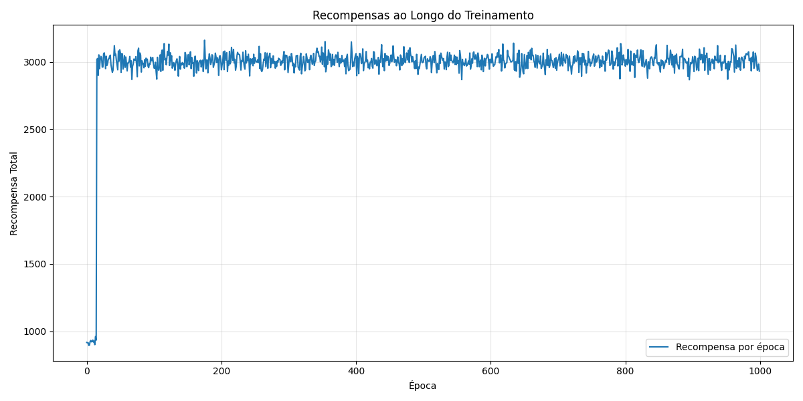
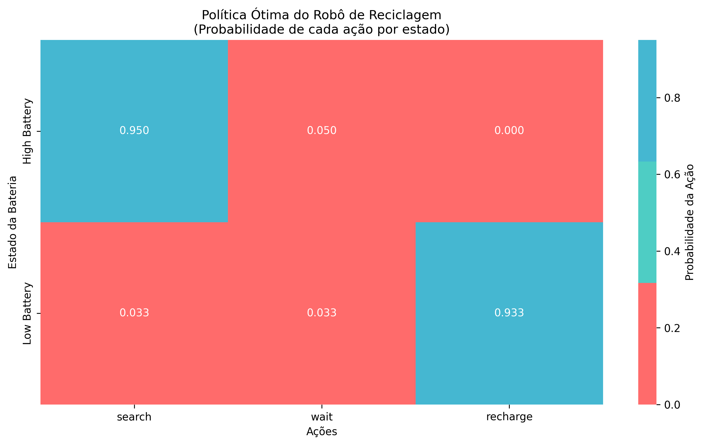

# Aprendizado por Reforço para Robô de Reciclagem

## Introdução

Este relatório descreve a implementação de um algoritmo de Aprendizado por Reforço, baseado em *Temporal Difference* (TD), para resolver o problema do Robô de Reciclagem, (Ex. 3.3 de Sutton & Barto - "Reinforcement Learning: An Introduction"). 

O agente aprende valores de estado e age com política *ε-greedy* com *one-step lookahead* usando o modelo conhecido (α, β e recompensas) para escolher ações. O objetivo é **maximizar a recompensa média** em uma tarefa contínua.


## Equipe

**Professor orientador:**
- Flávio Codeço Coelho

**Alunos participantes:**
- Jaime Willian Carneiro
- Luiz Eduardo Bravin
- Walleria Simões Correia

## Requisitos

Para instalar as bibliotecas necessárias, execute:
```bash
  pip install -r requirements.txt
```

## 1. Descrição do Problema (MDP)

O problema é modelado como um Processo de Decisão de Markov (MDP) finito, definido pelos seguintes componentes:

### Estados (S)

O robô pode estar em um de dois estados, baseados no seu nível de bateria:
* `high`: Nível de bateria alto.
* `low`: Nível de bateria baixo.

### Ações (A)

O conjunto de ações disponíveis depende do estado atual:
* `A(high)` = {`search`, `wait`}
* `A(low)` = {`search`, `wait`, `recharge`}

### Modelo de Transição e Recompensa

O modelo de transição e recompensa foi implementado conforme a descrição do livro-texto. As transições são probabilísticas e dependem dos seguintes parâmetros, que foram definidos para esta implementação:

* **`α`**: Probabilidade de a bateria permanecer alta após uma busca, começando com bateria alta: `high` $\rightarrow$ `search` $\rightarrow$ `high`.
* **`β`**: Probabilidade de a bateria permanecer baixa após uma busca, começando com bateria baixa: `low` $\rightarrow$ `search` $\rightarrow$ `low`.
* **`r_search`**: Recompensa esperada ao executar a ação `search`.
* **`r_wait`**: Recompensa esperada ao executar a ação `wait`.

A tabela a seguir, adaptada do livro-texto, resume a dinâmica do ambiente com os parâmetros escolhidos:

| Estado inicial | Ação | Estado final | Prob. | Recompensa  |
| :---: | :---: | :---: | :---: | :---: |
| high | search | high | α | r_search |
| high | search | low  | 1-α | r_search |
| low  | search | high | 1-β | -3 |
| low  | search | low  | β | r_search |
| high | wait   | high | 1 | r_wait |
| low  | wait   | low  | 1 | r_wait |
| low  | recharge| high| 1 | 0 |


## 2. Arquitetura do código
Modularizamos o código em três arquivos: `main.py`, `models.py` e `plot.py`

**main.py** - Arquivo principal, onde se encontram as funções `main()` responsável por inicializar o código e imprimir textos no terminal e `train()` responsável por treinar o modelo.

**models.py** - Arquivo para orientação a objetivo, onde estão modeladas as classes `Action`, `State`, `Game` e `Player`

- `Action`: identifica ação por `name`;
- `State`: identifica estado por `charge_level` e lista as `Action` permitidas por estado;
- `Player`: o robô de reciclagem. Possui os métodos `reset()` para voltar ao estado inicial, `act()` para selecionar a melhor ação a ser tomada naquele momento, `update()` para atualizar os estimadores (somente se a ação foi *greedy*), `backup()` que usa o método de diferença temporal para calcular a pontuação de cada ação e `get_policy()` para retornar o dicionário com as probabilidades de cada ação em cada estado;
- `Game`: ambiente com dinâmica (α, β, recompensas). Possui o método `transition()` que calcula a recompensa da ação do jogador em um passo da época.

**plot.py** - Arquivo para plotagem dos gráficos, onde estão as funções `plot_rewards` que plota a um gráfico de linha com as recompensas de cada época e `plot_policy_heatmap` que calcula política ε-greedy e plota heatmap por
estado/ação.

## 3. Implementação do Algortimo

Para treinar o modelo, usamos a lógica do exemplo Tic-Tac-Toe. Nele, empregamos o algoritmo de Temporal Difference (TD), porém, ao contrário do jogo da velha, o exemplo que temos aqui não possui um fim bem definido, a simulação acaba após um número específico de passos. Então, ao invés de fazê-lo aprender após o fim da simulação, resolvemos implementar o algoritmo TD(0), ou one-step TD, que atualiza os valores estimados imediatamente após cada transição de estado, sem precisar esperar o fim da simulação. O incremento em $V(S_t)$ é feito com a fórmula abaixo:

$$
V(S_t) \leftarrow V(S_t) + \alpha [R_{t+1} + \gamma V(S_{t+1}) - V(S_t)]
$$

Além disso, para que o algoritmo consiga decidir qual a melhor ação a se tomar dado um estado, também utilizamos a política $\epsilon$-greedy, assim, o modelo não realiza apenas só uma ação, mas consegue explorar outros métodos numa frequência pequena, mesmo que não sejam os melhores naquele momento. Porém, como são ações feitas de forma aleatória, elas não são consideradas na atualização do $V(S_t)$. 
Quando uma ação feita pelo robô é gananciosa - ou seja, não é aleatória - ele escolhe a ação que maximiza o valor esperado calculado pelo backup de 1 passo usando a fórmula abaixo para calcular o valor esperado de cada ação:

$$
q(s,a) = \mathbb{E}[R_{t+1} + \gamma V(S_{t+1}) | S_t = s, A_t = a]
$$

Assim, o robô avalia todas as ações possíveis em cada estado e executa aquela com maior $q(s,a)$, exceto quando decide explorar.


Por fim, para armazenar a política ótima e plotá-la no fim do treinamento, implementamos um método ```get_policy```, que cria um dicionário de probabilidades sobre as ações. Como estamos usando a política $\epsilon$-greedy, as probabilidades são:
- Ação ótima: $1 - \epsilon + \frac{\epsilon}{|A(s)|}$
- Demais: $\frac{\epsilon}{|A(s)|}$

## 4. Análise dos Resultados

Treinamos o modelo com os seguintes parâmetros:
* **`epochs`**: 1000
* **`steps_per_epoch`**: 1000
* **`α`**: 0.4
* **`β`**: 0.3
* **`r_search`**: 5
* **`r_wait`**: 1

Após o treinamento são gerados os arquivos:
- `rewards.txt`: histórico de recompensa total por época;
- `rewards.png`: gráfico de linhas de recompensas por época
- `policy_heatmap.png`: heatmap da política ε-greedy aprendida.

### Curva de Aprendizagem

O gráfico abaixo mostra a recompensa total acumulada ao final de cada época do treinamento.



Observa-se que em poucas épocas, o robô já aprende a fazer ações que maximizam a recompensa. Assim, nas épocas seguintes fica estável num certo intervalo, especificamente para os parâmetros que escolhemos, um intervalo ao redor de 3000.

### Política Ótima


No estado `high`, já que não há penalidade em nenhuma das ações possíveis nesse estado, o robô aprendeu a executar a mais lucrativa `search`.

No estado `low`, embora `search` seja mais lucrativo, também possui alta penalidade, assim o robô aprendeu a executar `recharge` opção mais segura por ser sempre neutra.
